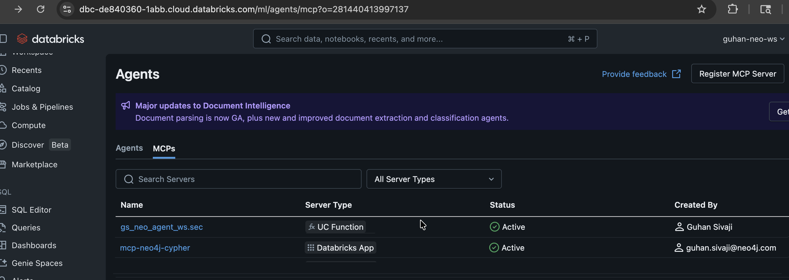
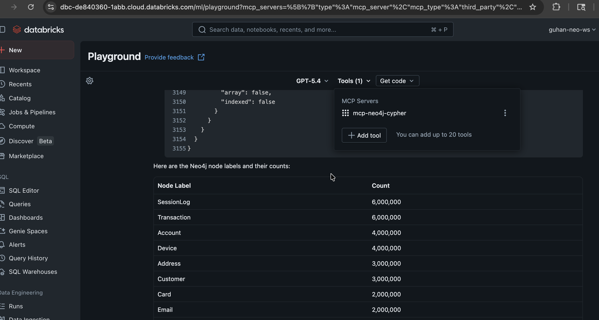

# Neo4j Cypher MCP Server (FastMCP)

A custom **[FastMCP](https://gofastmcp.com/)**-based MCP server that exposes
read-only Cypher and schema-introspection tools over a Neo4j Aura instance,
wrapped in a Starlette parent so the app has a real landing page on `/` and a
health endpoint — friendlier for demos than the bare PyPI `mcp-neo4j-cypher`.

## In action

Registered automatically in the workspace's **Agents > MCPs** registry by virtue of the `mcp-` name prefix:



Selected as a tool in the Databricks Playground and called against the live graph:



## HTTP surface

| Path | Method | Purpose |
|------|--------|---------|
| `/` | `GET` | HTML landing page: server identity, tool catalog, sample request |
| `/health` | `GET` | JSON `{"status": "healthy", ...}` for the Databricks Apps health probe |
| `/mcp/mcp` | `POST` | MCP Streamable HTTP transport (FastMCP). The Databricks Playground registers the app URL as the MCP base and appends `/mcp` to it, so the canonical endpoint is `/mcp/mcp`. |

## Tools

| Name | Description |
|------|-------------|
| `get_neo4j_schema(sample_size: int = 100)` | Returns labels, relationship types, property keys, and the top relationship patterns. Uses `apoc.meta.schema` when available; falls back to native `db.labels()` / `db.relationshipTypes()` / `db.propertyKeys()`. |
| `read_neo4j_cypher(query: str, params?: dict, row_limit: int = 50)` | Executes one read-only Cypher statement. Mutating clauses are rejected at the server. Returns JSON-serialized rows including nodes, relationships, paths, and temporal types. |

## Files

```
mcp-server/
├── app.yaml           # Databricks App command + NEO4J_* env mappings
├── landing.html       # HTML served at GET /
├── requirements.txt   # fastmcp, starlette, uvicorn, neo4j
└── server.py          # FastMCP tools wrapped in a Starlette parent (/ , /health, /mcp/mcp)
```

## Runtime contract

- Python 3.11+
- Binds `0.0.0.0:$DATABRICKS_APP_PORT` (set by Databricks Apps).
- Reads `NEO4J_URI`, `NEO4J_USERNAME`, `NEO4J_PASSWORD`, `NEO4J_DATABASE` from the environment (mapped from the `mcp-neo4j` Databricks secret scope via `databricks.yml`).
- Defaults `NEO4J_MAX_ROWS=50` (override per env).

## Local dev

```bash
uv venv && source .venv/bin/activate
uv pip install -r requirements.txt
export NEO4J_URI=neo4j+s://<your-aura-host>
export NEO4J_USERNAME=neo4j
export NEO4J_PASSWORD=<your-password>
export NEO4J_DATABASE=neo4j

uvicorn server:app --host 0.0.0.0 --port 8000
open http://localhost:8000/
```

## Smoke test (deployed)

```bash
TOKEN=$(databricks auth token --profile <profile> | jq -r .access_token)
URL=https://mcp-neo4j-cypher-<workspace-id>.aws.databricksapps.com

# Landing page
curl -s -o /dev/null -w "GET /        -> %{http_code}\n" -H "Authorization: Bearer $TOKEN" "$URL/"
curl -s -o /dev/null -w "GET /health  -> %{http_code}\n" -H "Authorization: Bearer $TOKEN" "$URL/health"

# MCP initialize -> SSE response with server capabilities
curl -sN -H "Authorization: Bearer $TOKEN" \
  -H "Content-Type: application/json" \
  -H "Accept: application/json,text/event-stream" \
  "$URL/mcp/mcp" -d '{
    "jsonrpc":"2.0","id":1,"method":"initialize",
    "params":{"protocolVersion":"2025-03-26","capabilities":{},
              "clientInfo":{"name":"smoke","version":"0.1"}}}'
```

> The Databricks Apps MCP registry treats the app URL as the MCP base and appends `/mcp` to construct the protocol endpoint, so the canonical path is `/mcp/mcp` (not `/mcp/`). Local probes (curl, MCP Inspector) should also target `/mcp/mcp`.

## Registering as an MCP server in Databricks

Any Databricks App named with the `mcp-` prefix is auto-listed in the
workspace's **Agents > MCPs** registry. No manual registration is needed.
The "Register MCP Server" button on that page is only for **external**
(non-Databricks-App) MCP endpoints.

## Consuming from the chat agent

`agent_server/agent.py` (when migrated to the Supervisor API):

```python
TOOLS = [
    {
        "type": "app",
        "app": {
            "name": "mcp-neo4j-cypher",
            "description": "Read-only Cypher and Neo4j schema introspection.",
        },
    },
]
```

Grant in `databricks.yml` under the agent app's `resources:` block:

```yaml
- name: mcp_neo4j_cypher
  app:
    name: mcp-neo4j-cypher
    permission: CAN_USE
```
